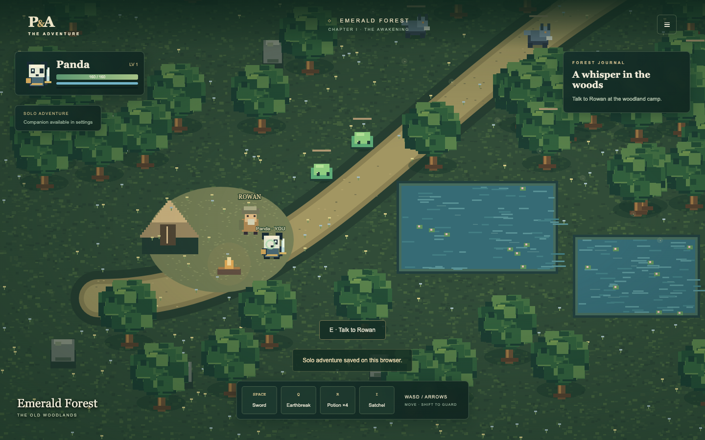

# Panda & Ape: The Adventure

An original, locally playable top-down action RPG built with **Phaser 4.2.1**, strict TypeScript and an authoritative two-player WebSocket server. Explore **Emerald Forest**, help Rowan, fight woodland creatures and defeat the Thorn Guardian. Version **0.2.0** adds permanent RPG progression, attribute allocation, a blacksmith, weapon upgrades, material loot and controlled enemy respawns. See [the 0.2.0 guide](docs/V0.2.0.md) for local testing and migration details.



The forest, characters, enemies and effects are original procedural pixel art. No external graphics, CDN or music downloads are needed to play. The interface is in English.

## Play with Docker

Requires Docker Desktop or OrbStack with Docker Compose v2. Apple Silicon ARM64 and Linux AMD64 are supported by the base images; validation details are in [docs/VALIDATION.md](docs/VALIDATION.md).

```sh
docker compose up -d --build
```

Open **http://localhost:8080**. Multiplayer connects to `/ws` through the same nginx origin. The server listens internally on port 3001 and is not published to the host. **http://localhost:8080/health** reports server health.

```sh
docker compose ps
docker compose logs -f
docker compose restart
docker compose down
```

The `saves` volume survives `down`. Do not add `-v` unless you intend to erase co-op saves.

## Run without Docker

Use Node **24 LTS** and npm. Installation needs Internet access once; gameplay works locally afterward.

```sh
npm ci
npm run dev
```

Open **http://localhost:8080**. Vite proxies `/ws` and `/health` to the server on port 3001. The shared package builds automatically before startup. Press Ctrl-C to stop both development services.

For separate terminals:

```sh
npm run build -w @panda/shared
npm run dev -w @panda/server
# In another terminal:
npm run dev -w @panda/game
```

For a compiled server: `npm run build` then `npm start -w @panda/server`. Serve the compiled frontend with a reverse proxy; `docker/nginx.conf` is the reference setup. `.env.example` documents server variables. When starting directly, export these variables in the shell; the server does not implicitly load `.env`.

Development containers with hot reload:

```sh
docker compose -f compose.dev.yaml up --build
```

Stop the production stack before starting development on the same port. After dependency changes, rebuild and remove the development `dev_modules` volume to refresh it.

## Two browser windows

1. Open the game in window 1, choose **Panda**, and click **Create co-op room**.
2. Open another window or browser context, choose **Ape**, enter the displayed five-character code, and click **Join a friend**.
3. Alternatively use **Copy invite link**; invitation links preselect Ape. If the room creator picked Ape, the joining player must choose Panda.
4. Move and fight. Both players see the same enemies, health, attacks, loot, quest progress and boss state. XP is awarded to both heroes.

A room holds two different heroes. A duplicate hero or a third player is rejected. One player can explore immediately while waiting for a friend. Disconnects reserve the seat for **60 seconds**. Live clients reconnect automatically; after a page reload, use **Reconnect to last co-op room** in that browser. Tokens are local to the browser and never included in invitations.

During online pause/inventory screens the player's input stops but the shared world continues. Reconnect preserves position, health, inventory, hero and room state. A server restart can restore recent saved rooms within the 60-second session window.

## Solo

**Begin adventure** runs the exact shared simulation in the browser, without a WebSocket connection. Choose either hero. An optional companion with simple follow/combat AI can be enabled in settings. Solo pause freezes simulation.

Solo progress is saved to localStorage every 15 seconds, on page unload and with **Save progress** in the pause menu. **Continue saved solo adventure** reloads the save. Start a new adventure to reset the region. Storage restrictions or private browsing may prevent saves.

## Controls

| Input                      | Action                                      |
| -------------------------- | ------------------------------------------- |
| WASD / arrow keys          | Eight-way movement                          |
| Space                      | Attack toward your last movement direction  |
| Left click in the world    | Aim at cursor and attack; hold to repeat    |
| Q                          | Special ability (35 mana)                   |
| R                          | Healing potion / revive at camp when downed |
| Shift                      | Panda's shield; reduces incoming damage     |
| E                          | Talk to Rowan when nearby                   |
| I                          | Inventory                                   |
| Escape / top-right menu    | Pause and settings                          |
| Gamepad left stick         | Move                                        |
| Gamepad A / X / B / Y / LB | Attack / special / potion / talk / guard    |

The quickbar also has clickable actions. Gamepad support uses the standard browser mapping; physical controllers have not been manually validated.

**Panda:** 160 base HP, sword with three-hit damage combo, shield and Earthbreak area attack. **Ape:** 110 base HP, faster movement, mana-powered projectiles and Bloom area damage with nearby ally healing. Mana regenerates. Level-ups restore health/mana, increase combat stats and grant three attribute points. Press I to allocate vitality, strength, dexterity and magic. Collect coins, leather, crystals, ancient materials and potions by walking over drops. Visit Bramble west of Rowan (E or I) to upgrade your weapon from +0 to +10 with materials and coins.

Talk to **Rowan** at the camp, defeat five creatures, then return for supplies. Follow the trail northeast to challenge the **Thorn Guardian**. Its orange ring warns of an incoming area attack; leave the ring before it lands. The eastern ancient gate is the visible extension point and currently remains sealed.

## Architecture

```text
apps/game/        Phaser scene, Vite, HTML/CSS HUD, procedural asset pipeline
apps/server/      Node HTTP health endpoint, WebSockets, rooms, SQLite persistence
packages/shared/  Protocol validation, world geometry, deterministic simulation
assets/           Asset manifest, map descriptor, provenance and replacement slots
docker/           Multi-stage production/development images and nginx proxy
tests/            Simulation/room tests, real socket integration, two-browser tests
docs/             Architecture notes, validation and limitations
```

The **server** alone determines online movement, collisions, damage, enemy AI, boss state, loot and health. Clients send validated intent at approximately 30 Hz; the simulation runs at 30 Hz and snapshots at 15 Hz. The renderer predicts local movement, reconciles acknowledged sequence numbers and smooths remote entities. Solo uses the same `step()` at 60 Hz.

A small `ws` server is used instead of Colyseus: the two-player slice needs no additional matchmaking/schema framework, and neither transport depends on Phaser's rendering version. Room membership and hero ownership remain server controlled. [docs/ARCHITECTURE.md](docs/ARCHITECTURE.md) describes tradeoffs.

Co-op saves use serialized atomic SQLite transactions through `SaveStore`. Permanent characters, inventory and reward receipts are separated from temporary rooms. Existing JSON saves are migrated once with backups, including expired rooms' character progression. Browser credentials restore a character into a new room after its reserved seat expires; recent-room reconnect still has a 60-second window. Solo browser saves are versioned and migrate the original localStorage format. Starting a new solo region retains the selected hero's progression. See [migration, backup and test instructions](docs/V0.2.0.md).

Slimes, wolves and wisps respawn at fixed points after 20/30/40 seconds when safe and below population limits. Bosses require a deliberate encounter reset at Rowan after loot collection and retreat. Rules and formulas are in `packages/shared/src/rpg.ts`; online configuration accepts `RESPAWN_CONFIG`.

## Quality checks

```sh
npm run typecheck
npm run lint
npm run format:check
npm test
npm run build
npx playwright install chromium
npm run test:browser
docker compose config --quiet
docker compose -f compose.dev.yaml config --quiet
docker compose build
# With the production stack running (restarts this stack):
npm run test:docker
```

Integration tests launch an isolated server on port 3002 with temporary saves. Browser tests use port 8080 and either reuse a running local game or launch development services. Run browser tests against the Docker stack to cover the production reverse proxy too. GitHub Actions runs lint, typecheck, formatting, tests, builds, Chromium and image builds for ARM64 and AMD64. GPU-less CI runs the Phaser Canvas fallback; movement assertions await actual state rather than assuming a fixed rendering rate. Generated screenshots and traces are in `test-results/`, excluded from Git.

See [docs/VALIDATION.md](docs/VALIDATION.md) for checks actually executed in the development environment.

## Troubleshooting

- **Port 8080 occupied:** stop the other development/Compose process. Check `docker compose ps` and `docker compose logs`.
- **Room not found:** use the code from the active server. Rooms expire; old invitation links cannot recreate them.
- **Hero taken / room full:** choose the other hero. A disconnected seat remains reserved for 60 seconds.
- **Connection failed:** check `/health`, server logs and the same-origin `/ws` proxy. Solo still works with only the frontend available.
- **Reconnect expired:** create a new room. The UI reports failure rather than silently replacing a co-op session.
- **Black canvas:** use a browser with WebGL enabled; Phaser AUTO can fall back to Canvas rendering. Check the browser console.
- **No sound:** enable forest music in settings and interact with the page to unlock browser audio.
- **Downed:** press R to consume a potion and revive at camp. If you have no potions, start a new adventure.
- **Restricted execution environment:** local port binding, browser launch, npm downloads, Docker sockets and GitHub keychain access may require the environment's execution approval. Do not misreport blocked checks as passed.

## Deployment and extension

Production frontend and `/ws` must share an origin. Terminate TLS at an outer reverse proxy and pass WebSocket upgrade headers; the browser selects `wss` automatically for HTTPS. This version targets trusted local co-op and does not implement public accounts, password-protected rooms or public-service abuse protection beyond bounded messages/rates/capacity.

To add regions, extract the current world descriptor and collision list into map registries; keep map IDs and transitions authoritative. Replace procedural art using the texture keys, 64×64 frames and eight-direction layout in `assets/manifest.json`; rendering is separated from combat. Add enemy definitions to shared simulation, then test behavior without Phaser. A later release can add pathfinding, richer directional combat/cast animations, expanded content. [The sprite-sheet pipeline](docs/SPRITES.md) imports finished local sheets with explicit provenance and licensing; future Panda/Ape reference images can guide replacements without changing combat.

Code: MIT. Original generated art/audio: CC0; see [assets/LICENSE.md](assets/LICENSE.md). The repository is intended to remain **private**.
