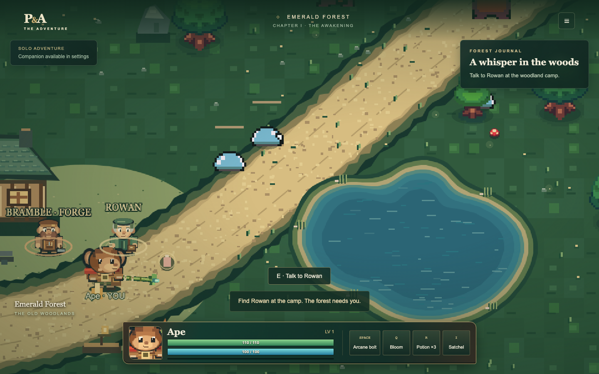
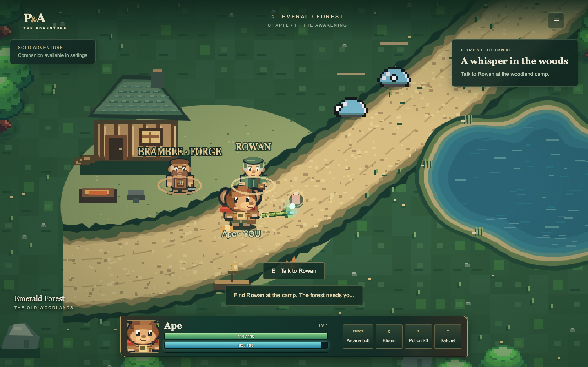
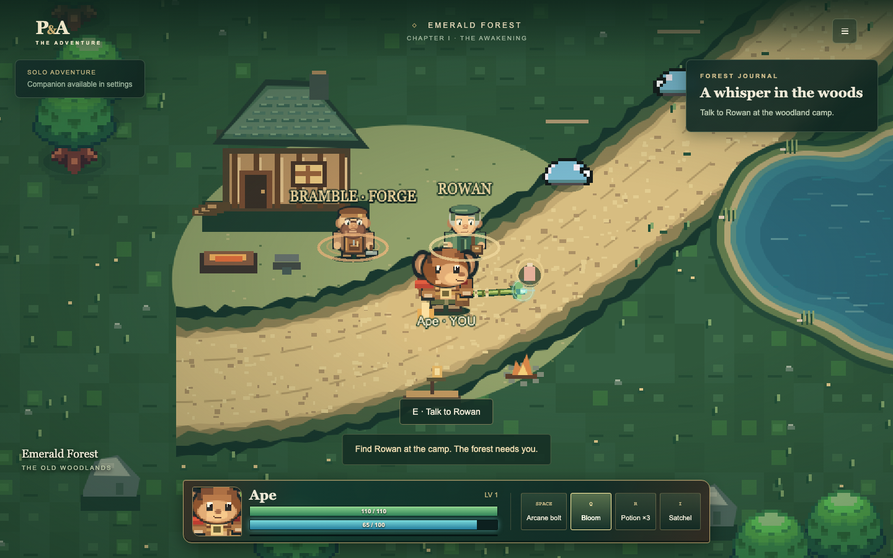

# Ape mage casting polish

Ape now uses `mage-pose.ts` rather than the sword's wind-up/sweep timeline.
The staff remains near the hand, with a 28-pixel grip reach, a small ready tilt,
a focused channel, a precise aim gesture and a smooth return to idle. Normal
casts cover 0.22 radians (about 13 degrees); special casts cover 0.32 radians
(about 18 degrees). Body lean stays below one degree and translation below one
pixel. Special channeling lasts longer within the existing visual cooldown.
Panda's pose calculations and sword trails retain their previous behavior.

`mage-effects.ts` owns the restrained mint/teal/blue glow, three or four drifting
motes, expanding release ring and directional glint. A short tapered wake follows
the actual friendly bolt velocity. The old oversized Bloom world circle is
replaced by this focused staff feedback; its authoritative area stays intact. Effects use the existing graphics object;
there are no particle emitters, new textures, audio nodes or runtime downloads.
Reduced motion dims the effects and stops mote drift.

Release feedback is driven by authoritative projectile IDs or the existing
Bloom magic effect (radius 180, versus hostile magic's 145). Bloom also checks
an active Ape special near the event location, allowing movement between
snapshots. New worlds, reconnect baselines and rollback do not replay releases.
Held snapshots never restart a pulse, and empty-mana attempts emit no pulse.
The authority currently releases spells immediately; the visual ready/channel
pose does not postpone the spell, its pulse, mana spending or damage. It conveys
concentration around the existing release rather than adding gameplay wind-up.

All eight facing directions keep side/north weapons behind the hero and front
staff segments outside the face region. Body shifts still affect rendering only.
No shared simulation, protocol, save format, HUD layout, combat stats or sounds
changed. Phaser 4.2.1 graphics APIs were checked in installed sources.

## Browser captures





## Local validation

Use Node 24, then run:

```bash
npm ci
npm run typecheck
npm run lint
npm run format:check
npm test
npm run build
docker compose up -d --build --wait
npm run test:docker
PLAYWRIGHT_EXTERNAL_SERVER=1 npm run test:browser
```

The production game is available at http://localhost:8080. See
[VALIDATION.md](VALIDATION.md) for executed results. The existing sprite sheets
still supply the arms/head; concentration is communicated through staff/body
pose and effects rather than a new skeletal or off-hand animation rig.
