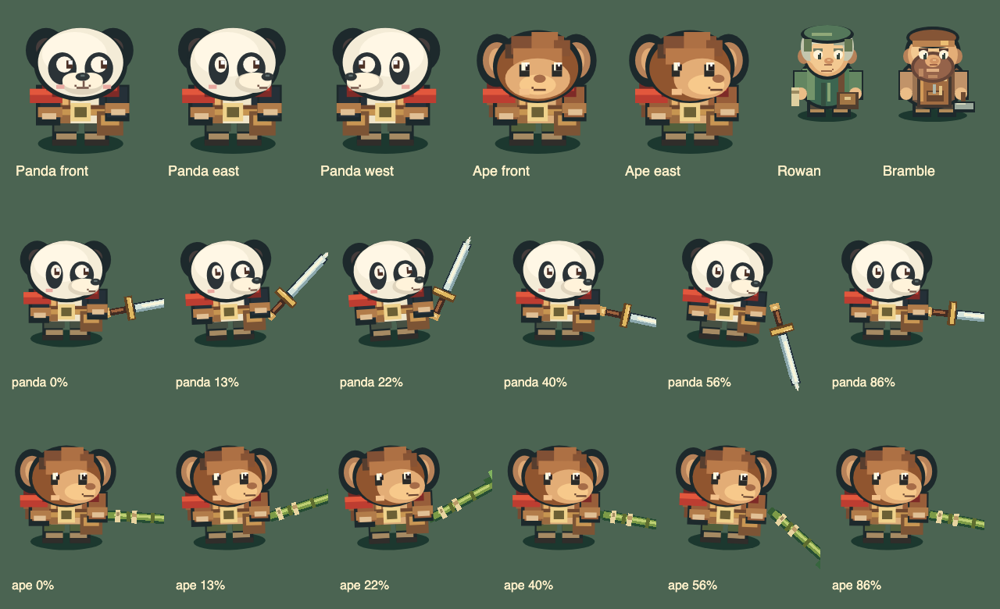
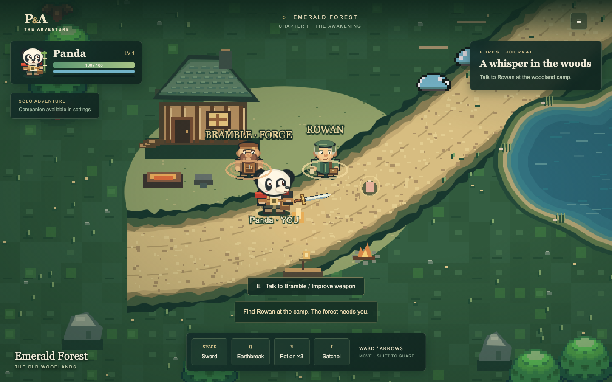
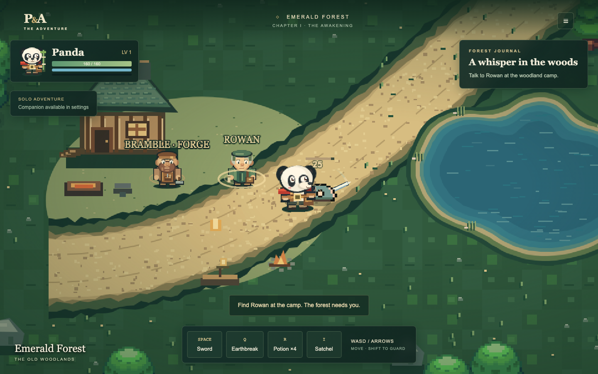

# Character and combat polish

Rowan is now a silver-haired woodland guide with a sage hood, leaf clasp,
folded cloak, satchel and rolled map. Bramble has a wider silhouette, leather
cap, warm beard, riveted apron, tool pocket and a low-held hammer. Both are drawn
at the heroes' native 64-pixel resolution. Rowan retains the `npc` texture key;
Bramble receives a distinct `bramble` frame. Their locations and interactions
are unchanged.

Panda has smaller rounded eye patches, soft cheek shapes, a highlighted button
nose and a short upturned smile. Ape now has a similarly readable three-quarter
side face with both eyes, an offset muzzle and a cleaner smile. Hero sheet keys,
direction rows and frame sizes remain stable. Character name labels now sit
below the boots so they do not obscure nearby NPC faces.

Weapon motion uses smooth anticipation (first 22%), a quicker sweep (22–56%) and
recovery (56–100%). Phase boundaries and the return to idle join without a pose
snap. Slight body lean and texture-origin shifts follow the same motion instead
of the previous unrelated oscillation. Walk-only sprites plant their feet for
attacks; supplied attack/special blocks remain supported. A rendering clock
continues smoothly between multiplayer snapshots, preserves special timing,
stops a stale attack at the end of its visual duration and freezes with solo
pause. It does not predict hits or alter authoritative cooldowns.

A short, fading crescent follows the blade around its actual grip. Small impact
sparks and a seven-percent compression use confirmed hit/hurt state; damage
numbers and existing sounds remain. The redundant full circular normal-melee
ring is removed. No camera shake or simulation hit-stop was added.

This pass changes client rendering only. Shared simulation, collision, server,
controls, combat reach/damage/cooldowns, save schema and reconnect logic are
unchanged. In particular, visual anticipation does not delay damage. Original
artwork provenance and CC0-1.0 are recorded in `assets/LICENSE.md`.

## Review images

The pose sheet uses the actual character generator and weapon-pose functions,
showing idle, draw-back, strike, follow-through and recovery. Gameplay images
come from the production Docker build. The combat review uses a seeded solo
encounter; damage was confirmed through the HUD.

See [VALIDATION.md](VALIDATION.md) for executed checks and practical limits.
