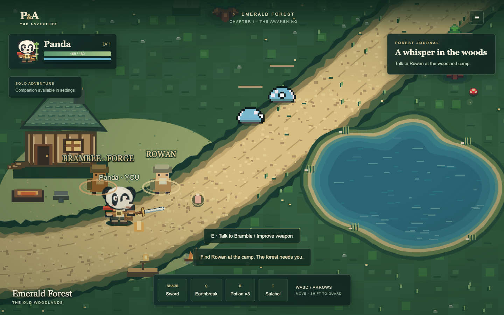
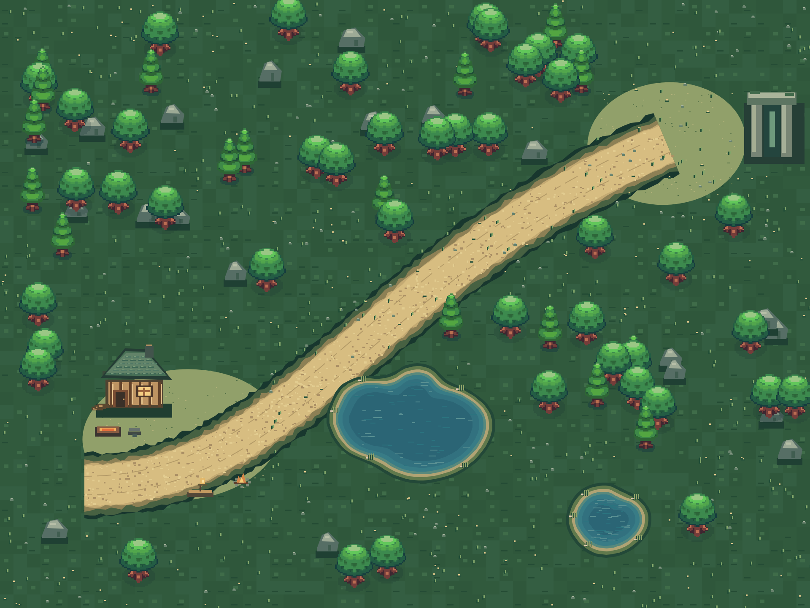

# Emerald Forest visual cleanup

Panda's east/west poses now keep both eyes visible in a three-quarter face, with
an offset muzzle. Sword and staff grips sit lower and farther from the head;
side/north views render weapons behind the hero. Texture keys, eight direction
rows and four-frame walks retain their existing contracts.

A shared camp keep-out rectangle protects the complete smithy roof/chimney,
Rowan, Bramble, their labels, the woodpile, forge, anvil, bench, lantern and hearth.
Placement checks use the full canopy envelope, including the procedural fallback,
rather than just tree trunks. Mushrooms and ground decorations also respect the
zone. Gate scenery receives its own protection. The forge and anvil sit west of
Bramble; the bench and hearth sit south of the trail, leaving the central camp
open. Random ground accents are reduced from 1,750 attempts to 1,050.

Trees retain the first vendor frame, avoiding the pronounced canopy frame loop.
Their rotation amplitude drops from 0.3 degrees to 0.06 degrees with half the
frequency. The primary lake has a rounded bay, inlet and layered banks. The
smaller pond is relocated well southeast, with an open meadow between them.
Sparse reed clusters and slower reflections follow the new shorelines.

The shared deterministic layout changes only water bounds and scenery colliders
that conflict with the protected areas or new shorelines. Four-pixel collision
bands follow the same rounded polygons used for rendering, including separated
intervals at concave inlets. The existing rectangle collision/sliding algorithm,
fixed spawns, ruin colliders and unrelated seeded tree positions are preserved.
Combat, multiplayer protocols, rewards, save format and reconnect rules remain
unchanged. No new external assets or dependencies were added; provenance is
recorded in [assets/LICENSE.md](../assets/LICENSE.md).

## Review images

The gameplay screenshot includes live NPCs, heroes and the HUD. The map preview
shows the complete authored backdrop and the actual vendor tree selections; it
omits moving entities, mushrooms and the HUD for composition review.

Executed checks and practical limits are recorded in [VALIDATION.md](VALIDATION.md).
