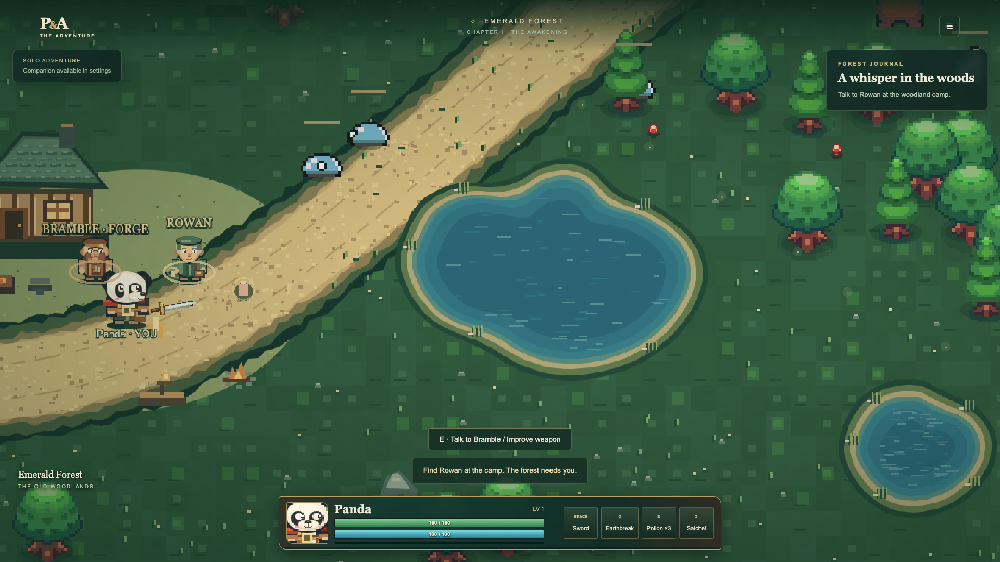
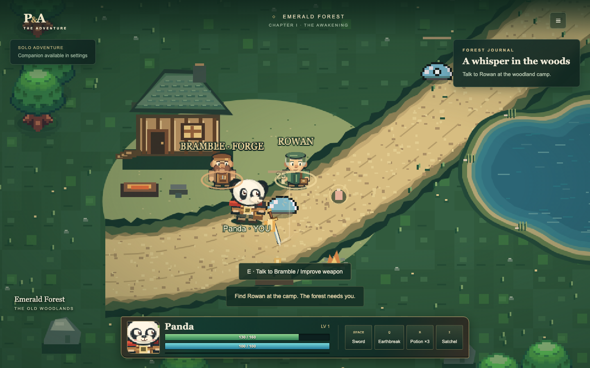
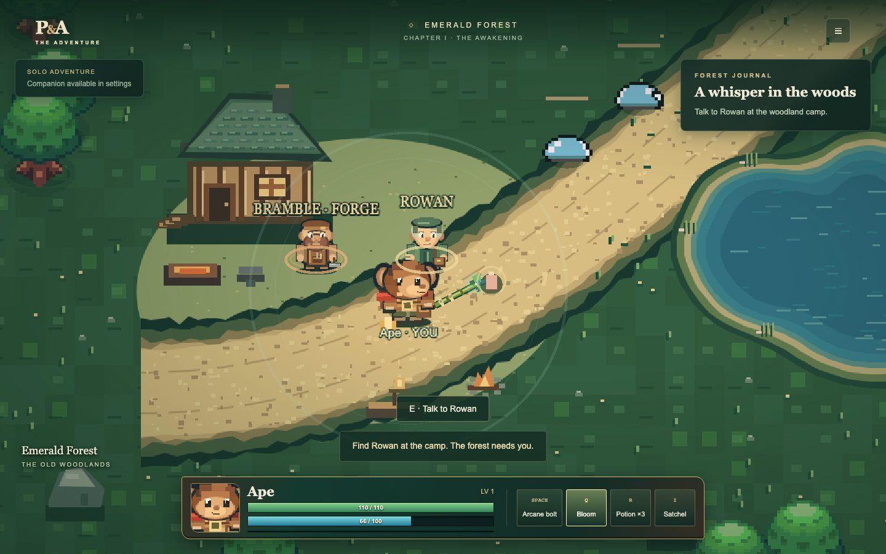
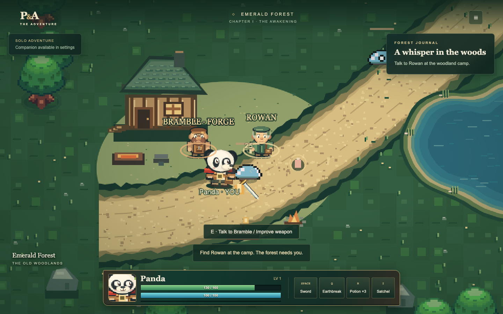
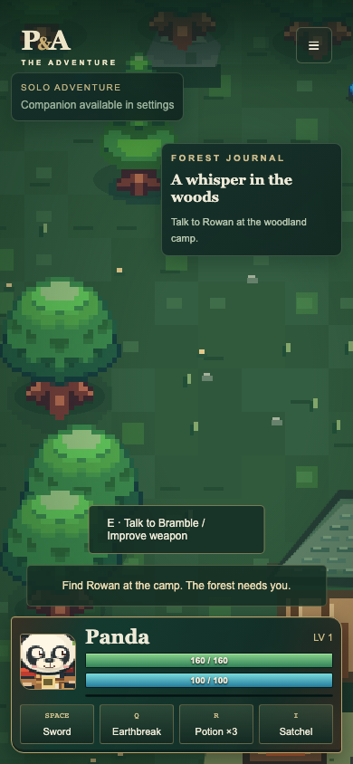
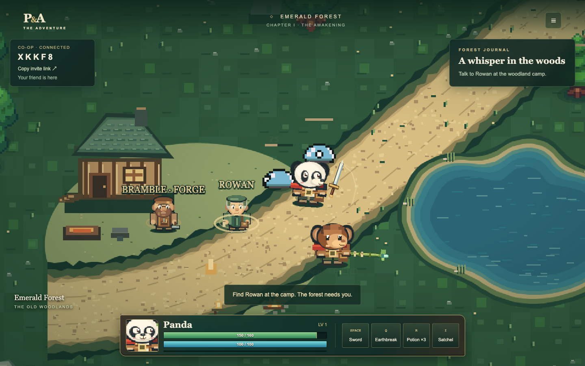

# Premium combat and character HUD

The bottom woodland frame unifies the existing character status and four action
buttons. It includes a framed crop of the original hero art, level, numeric HP
and mana, XP line and potion count. Health and mana interpolate in CSS while
labels report current authority values. A slower amber health layer records
recent damage; portrait/health and mana feedback indicate damage and spending.
The HUD adapts to a two-row phone layout and keeps journal and connection status
accessible. Existing controls and dialogs retain their IDs and behavior.

Panda's authoritative combo selects horizontal, rising and descending poses.
Quintic anticipation, sweep and recovery join continuously in all eight
orientations. Curved grip movement coordinates with body lean; north and side
weapons stay behind the hero to protect face readability. `WeaponTrails` retains
at most twelve blade-tip samples per hero and fades warm white/gold traces over
150 ms. Ape has separate normal and special casting poses and staff-tip motes;
release pulses require an actual projectile or authoritative magic effect.

`CombatFeedback` deduplicates confirmed hit IDs, baselines new worlds/reconnects,
and pauses only its visual animation clock for 45 ms. Clock offset avoids a
recovery jump. The simulation, input, network and camera position continue.
Nearby confirmed hits add a tiny 60 ms camera impulse. Existing enemy hurt tint,
compression and floating damage labels remain, with directional spark fans.
Reduced motion disables hitstop, shake and bar transitions and dims trails.
Existing one-shot audio tracking and independent audio settings are preserved;
visual anticipation does not delay authoritative damage or its impact sound.

No shared/server code, protocol, combat values, collision, save format, upgrade
rules or dependency versions changed. Phaser 4.2.1 camera and texture APIs were
checked in installed sources/declarations. Presentation tests cover all combo
paths/directions and phase continuity, authority deduplication, hitstop recovery,
status changes and responsive browser behavior, alongside existing regressions.

Phone layout is supported, but the existing game still has no touch movement
pad. Body animation uses procedural lean/origin shifts with the existing sprite
frames; this is not a new skeletal rig. Browser screenshots are review captures,
not a cross-device performance guarantee.

## Chromium review captures








## Local verification

Use Node 24 and run:

```bash
npm ci
npm run typecheck
npm run lint
npm run format:check
npm test
npm run build
npm run dev
```

In a second terminal, run `npm run test:browser`. For production:

```bash
docker compose config --quiet
docker compose -f compose.dev.yaml config --quiet
docker compose up -d --build --wait
npm run test:docker
PLAYWRIGHT_EXTERNAL_SERVER=1 npm run test:browser
```

Open http://localhost:8080 to play. Stop the development server before starting
Compose because both use port 8080. Existing Chromium installation is required
for browser tests; install it with `npx playwright install chromium` if absent.
